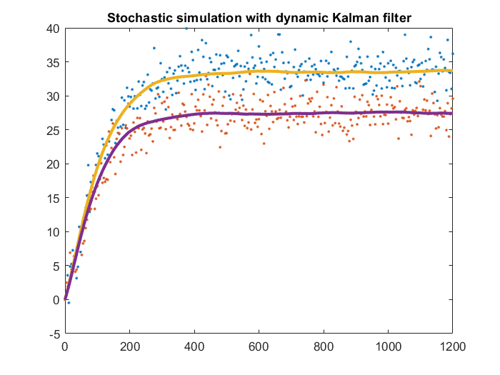

# Kalman-Filter

The Kalman Filter is an optimal recursive algorithm used to estimate the state of a dynamic system from noisy measurements. It operates in two stages: prediction, where it forecasts the system’s next state, and update, where it refines this prediction using incoming data. This makes it suitable for both static and dynamic systems.

In this code, I have implemented both static and dynamic Kalman Filters, with the physical model being a well-known 4-tank water system including 2 pumps.

<!--  -->

